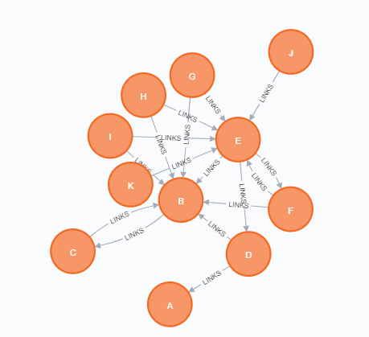
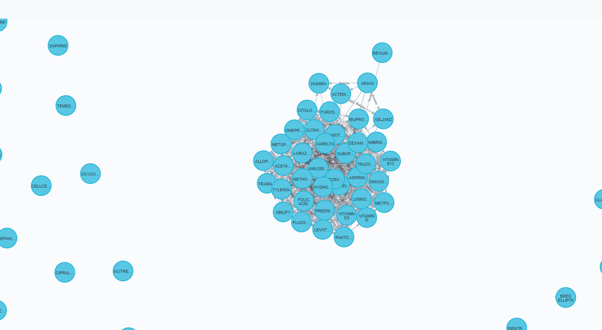

# Lab07 - Análise de Redes

## Tarefa de análises feitas no Cypher
>
## Exercício 1

Calcule o Pagerank do exemplo da Wikipedia em Cypher:

~~~cypher
LOAD CSV WITH HEADERS FROM 'https://raw.githubusercontent.com/santanche/lab2learn/master/network/pagerank/pagerank-wikipedia.csv' AS line
MERGE (p1:Page {name:line.source})
MERGE (p2:Page {name:line.target})
CREATE (p1)-[:LINKS]->(p2)

CALL gds.graph.create(
  'prGraph',
  'Page',
  'LINKS'
)

CALL gds.pageRank.stream('prGraph')
YIELD nodeId, score
RETURN gds.util.asNode(nodeId).name AS name, score
ORDER BY score DESC, name ASC

CALL gds.pageRank.stream('prGraph')
YIELD nodeId, score
MATCH (p:Page {name: gds.util.asNode(nodeId).name})
SET p.pagerank = score

CALL gds.pageRank.stream('prGraph')
YIELD nodeId, score
RETURN gds.util.asNode(nodeId).name AS name, score AS pagerank
~~~

Não foi possível traçar os grafos com o Gephi ou o CytoScape por problemas em ambos os softwares. Entretando, foram obtidos os seguntintes valores para o pagerank e o seguinte grafo no Neo4j:

|name|pagerank           |
|----|-------------------|
|B   |3.422628361545502  |
|C   |3.0444085506722334 |
|D   |0.36260066517154566|
|E   |0.7503553031226835 |
|F   |0.36260066517154566|
|G   |0.15000000000000002|
|H   |0.15000000000000002|
|I   |0.15000000000000002|
|J   |0.15000000000000002|
|K   |0.15000000000000002|
|A   |0.3041052853903018 |

## Exercício 2

Departing from a Drug-Drug graph created in a previous lab, whose relationship determines drugs taken together, apply a community detection in it to see the results:

~~~cypher
// Drogas que tratam a mesma patologia (exemplo do lab anterior):
LOAD CSV WITH HEADERS FROM 'https://raw.githubusercontent.com/santanche/lab2learn/master/data/faers-2017/drug-use.csv' AS line
MATCH (d:Drug {code: line.codedrug})
MATCH (p:Pathology {code: line.codepathology})
MERGE (d)-[t:Treats]->(p)
ON CREATE SET t.weight=1
ON MATCH SET t.weight=t.weight+1

MATCH (d1:Drug)-[a]->(p:Pathology)<-[b]-(d2:Drug)
WHERE a.weight > 20 AND b.weight > 20
MERGE (d1)<-[r:Relates]->(d2)
ON CREATE SET r.weight=1
ON MATCH SET r.weight=r.weight+1

// Detectando a comunidade
CALL gds.graph.create(
  'communityGraph',
  'Drug',
  {
    Relates: {
      orientation: 'UNDIRECTED'
    }
  }
)

CALL gds.louvain.stream('communityGraph')
YIELD nodeId, communityId
RETURN gds.util.asNode(nodeId).name AS name, communityId
ORDER BY communityId ASC

CALL gds.louvain.stream('communityGraph')
YIELD nodeId, communityId
MATCH (d:Drug {name: gds.util.asNode(nodeId).name})
SET d.community = communityId

CALL gds.louvain.stream('communityGraph')
YIELD nodeId, communityId
RETURN gds.util.asNode(nodeId).name AS name, communityId
~~~

Novamente, não foi possível traçar os grafos com o Gephi ou o CytoScape por problemas em ambos os softwares. Entretando, são mostrados no csv a seguir alguns valores da communityId, dado que a lista completa é extensa, e o grafo no Neo4j. Por limitações da plataforma, não foi possível mostrar todos os nós, mas todos os não ligados ao conjunto no centro da imagem não possuem arestas:

|name                                                                                                                                                                              |communityId|
|----------------------------------------------------------------------------------------------------------------------------------------------------------------------------------|-----------|
|ACZ885                                                                                                                                                                            |0          |
|METFORMIN                                                                                                                                                                         |9          |
|COZAAR                                                                                                                                                                            |2          |
|GILENYA                                                                                                                                                                           |35         |
|JAKAFI                                                                                                                                                                            |4          |
|CALCIUM CARBONATE.                                                                                                                                                                |5          |
|MULTIVITAMIN /00097801/                                                                                                                                                           |6          |
|SYMBICORT                                                                                                                                                                         |7          |
|FLUOXETINE                                                                                                                                                                        |9          |
|SIMVASTATIN.                                                                                                                                                                      |9          |
|HYDROCODONE BITARTRATE AND ACETAMINOPHEN                                                                                                                                          |10         |
|VITAMINS NOS                                                                                                                                                                      |11         |
|TYLENOL WITH CODEINE                                                                                                                                                              |12         |
|GLIPIZIDE.                                                                                                                                                                        |13         |
|VITAMIN D3                                                                                                                                                                        |9          |
|BREO ELLIPTA                                                                                                                                                                      |15         |
|ALBUTEROL SULFATE.                                                                                                                                                                |16         |
|VICODIN                                                                                                                                                                           |17         |
|FAMOTIDINE.                                                                                                                                                                       |18         |
|PRAVASTATIN.                                                                                                                                                                      |19         |
|VITAMIN C                                                                                                                                                                         |20         |
|LOVASTATIN.                                                                                                                                                                       |21         |
|ASPIRIN /00002701/                                                                                                                                                                |22         |
|LEVOTHYROXINE.                                                                                                                                                                    |9          |
|ZOLOFT                                                                                                                                                                            |24         |
|ISENTRESS                                                                                                                                                                         |25         |
|XTANDI                                                                                                                                                                            |26         |
|FOSAMAX                                                                                                                                                                           |27         |
|ALENDRONATE SODIUM.                                                                                                                                                               |28         |
|EFAVIRENZ.                                                                                                                                                                        |29         |
|LIPITOR                                                                                                                                                                           |30         |
|PROVENTIL                                                                                                                                                                         |31         |

